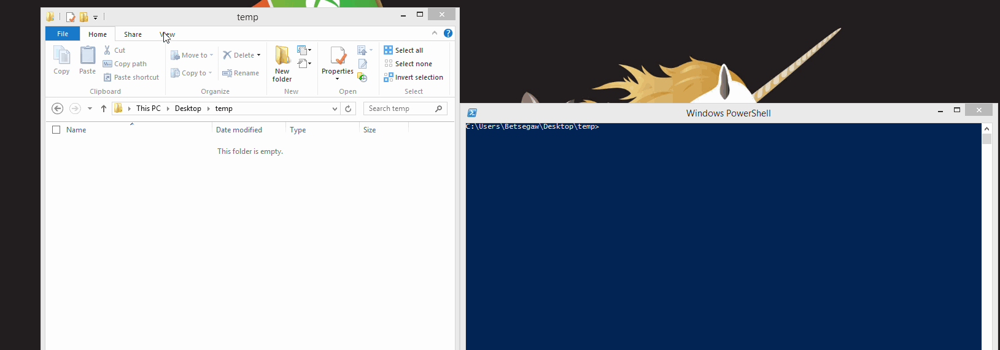
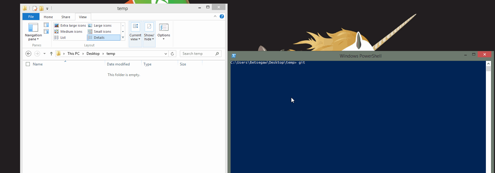
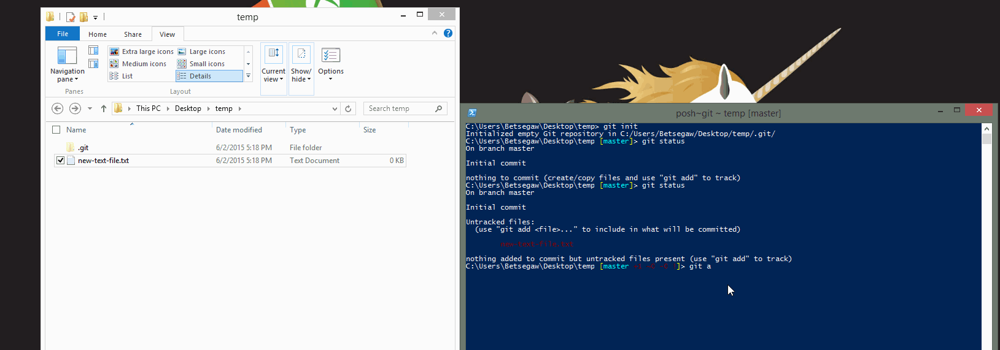
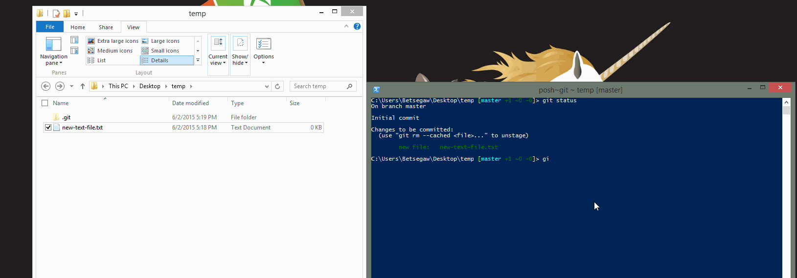

# Introduction

There are a million tutorials out there but none of them try to start from the simplest usecase and build towards the most difficult. 

**Which is why I decided to roll my own tutorial.**

We will start with the simplest Git setup and try to make the initial introduction easy.

# Basic Volcabulary

**Git Repository** - The set of all files and folders that you want to track together and their version history are contained within this structure.
**Commit** - A commit is basically a snapshot of the state of your repository folder.

# The Setup

1. Install Git
2. Make sure that you can see hidden files

# Creating the repository

1. **Looking at an empty folder, do a `git init` inside it from the command prompt.**
2. **A new folder called `.git` should now appear in the empty folder. Quickly looking inside should show you a bunch of folders, which we are not going to concern ourselves with for now.**

Think of `git init` as the  equivalent of File -> New for files. It creates the repository in the folder you executed it in. All the effects of the command are contained in the `.git` folder (so no registry keys or files set). Infact, if you copy and paste the folder to another path, git won't even notice.

# Adding and editing new files

1. **Type a quick `git status` in the command prompt.**

    You should be greeted with a message that basically says there is nothing new.

2. **Create a new text file in the folder (as shown in the animation).**
3. **Type `git status` again.**
    
    You should now see that the new file has been detected by git but is marked as `untracked` by Git.

# Tracking a new File

1. **Type in `git add` and press tab and it should populate the name of your file.** 
    
    You can also type out the name of the file or append a '--all' to add multiple files at once.
2. **Type in `git status` again and you can see that it has readied the new file***

# Making a commit

Now that you have added the 